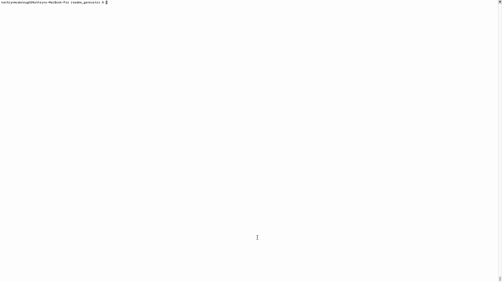

# readme_generator
    

    
## Table of Contents 
[Description](#description)  
[Installation](#installation)  
[Usage](#usage)  
[Credits](#credits)  
[License](#license)  
[Contributing](#contributing)  
[Tests](#tests)  
[Questions](#questions)  

## Description
generate a professional README from your terminal!  Follow a series of prompts and a README file will generate in the current directory with markdown syntax.

## Installation
npm i

## Usage

## Credits
n/a

## License 
Copyright &#169; 2021 Licensed under the MIT license.

## Contributing
git clone from GitHub

## Tests
npm test

## Questions
Conact me at kaytemcdonough@gmail.com with questions. You can submit a pull request or issue on GitHub [https://github.com/UseTheHill](https://github.com/UseTheHill).
